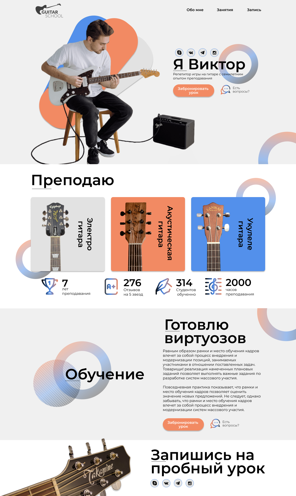

# Вёрстка по макету в Figma

В рамках проекта нужно сверстать макет сайта, который выглядит, как на скрине:
  
 

___

**Ссылка на макет:** [макет в figma](https://www.figma.com/file/TLrzgvXyBbWWNtpCtuMH2V/%D0%9C%D0%B0%D0%BA%D0%B5%D1%82-%D0%9F%D0%BE%D1%80%D1%82%D1%84%D0%BE%D0%BB%D0%B8%D0%BE-%D0%B3%D0%B8%D1%82%D0%B0%D1%80%D0%B8%D1%81%D1%82%D0%B0?type=design&node-id=1%3A2&mode=design&t=PpEM085MVEIqbvZK-1)

___

## Требования к проекту:  

1. вёрстка должна быть выполнена с помощью технологии CSS Flexbox  
2. вёрстка должна быть выполнена с использованием препроцессора SASS  
3. адаптировать вёрстку под мобильные и планшетные устройства  